<p align="center">
  
</p>

<p align="center">
  <a href="https://linkedin.com/in/viktor-oleksiukh"></a>
  <a href="mailto:oleksuh@gmail.com"></a>
  <a href="https://bsky.app/profile/stereocoded.bsky.social"></a>
  <a href="https://mastodon.social/@stereocode"></a>
  
</p>

---

I'm a backend engineer with years of production **PHP, Laravel and WordPress** work behind me, and I'm now moving deliberately into **Node.js and TypeScript**.

What I enjoy most isn't the feature ticket. It's the layer underneath it: **the tools, pipelines and frameworks that make a whole team faster and safer.** Monitoring platforms, security programs, performance tracking, and AI-assisted development workflows that everyone on the team inherits through git.

## 🧰 What I build

<table>
<tr>
<td width="33%" valign="top">

**Platform & tooling**

Laravel 12 admin platform that aggregates **security and performance data** across a whole portfolio of managed WordPress sites: CVE/CVSS tracking, header checks, Core Web Vitals deltas, regression flags and conditional reporting.

</td>
<td width="33%" valign="top">

**Security & performance**

Authored a **6-layer WordPress security framework** (infrastructure → CMS → application → perimeter → monitoring → governance) and a performance program built on automated measurement, sprints and client-facing reports.

</td>
<td width="33%" valign="top">

**AI-assisted engineering**

Version-controlled **AI dev layer** shared across projects: agents with persistent memory, MCP integrations, a Semgrep + LLM CI security pipeline, a WordPress-as-MCP-server prototype, and AI-generated Schema.org JSON-LD in production.

</td>
</tr>
</table>

## 🚧 Right now

Working through a structured, mentored **Node.js backend program**, deliberately systems-first rather than framework-first:

```text
TypeScript type system ─▶ event loop & streams ─▶ Fastify + Postgres service
      ─▶ transactions & isolation levels ─▶ RabbitMQ, Outbox & Sagas
      ─▶ NestJS microservices ─▶ OpenTelemetry · Prometheus · Grafana
```

Projects from this track will go public here as they reach review quality.

## 🛰️ Selected projects

| | Project | What it is | Stack |
|:-:|---|---|---|
| 🎮 | **[Elite-RG35XX](https://github.com/codedamage/Elite-RG35XX)** | Native port of *Elite: The New Kind* to the Anbernic RG35XX handheld. Cross-compiled for armv5te/uClibc through a custom SDL 1.2 backport shim, software-rendered, with a Docker-based headless simulator for screenshots. | C · SDL · Docker |
| 🧠 | **[CodeDex](https://github.com/codedamage/CodeDex)** | Spaced-repetition flashcard app with a hand-rolled SM-2 scheduler, review state kept separate from content, markdown card backs and image uploads. | TypeScript · Next.js |
| 🎲 | **inkRPG** 🔒 | AI-narrated, single-player tabletop RPG engine as a KOReader plugin: game-agnostic engine plus content-only game packs, verified end to end in a Dockerised KOReader emulator. | Lua · Docker |
| 📚 | **Gemma2b-MD-RAG-Base** 🔒 | Fully local RAG stack: point it at a folder of Markdown files and ask questions. Ollama + ChromaDB + an Express API, with hash-based incremental re-indexing. No cloud, no API keys. | Node.js · Docker · LLM |
| ⚔️ | **MicrolearningJS** 🔒 | A 49-quest JS curriculum where every quest adds real code to one growing CLI RPG, plus a Next.js tracker with XP and streaks. | JavaScript · TypeScript |

<sub>🔒 = private for now. Happy to walk through any of them on a call.</sub>

## 🛠️ Stack

**Production:**<br/>


**Growing into:**<br/>


**AI tooling:**<br/>


## 🧭 How I work

- **Frameworks over one-offs.** If a problem shows up on three projects, it deserves a tool, a checklist or a pipeline.
- **Measure, then optimise.** Performance and security work starts from data (PSI, CVSS, profiles), not guesses.
- **AI as a force multiplier, not a crutch.** I design the workflow, review the output, and own the result.
- **Offline-first when it matters.** Self-hosted, local-LLM and privacy-respecting setups are a recurring theme.

## 🕹️ Off the clock

Porting games to retro handhelds, running a self-hosted homelab, flight-sim nerdery, and painting Warhammer 40k miniatures.

## 🤝 Let's talk

Open to conversations about **backend and platform work (Node.js/TS or PHP/Laravel)**, **WordPress architecture, security and performance**, and **AI-assisted developer tooling**. The fastest way to reach me is [LinkedIn](https://linkedin.com/in/viktor-oleksiukh) or email.
